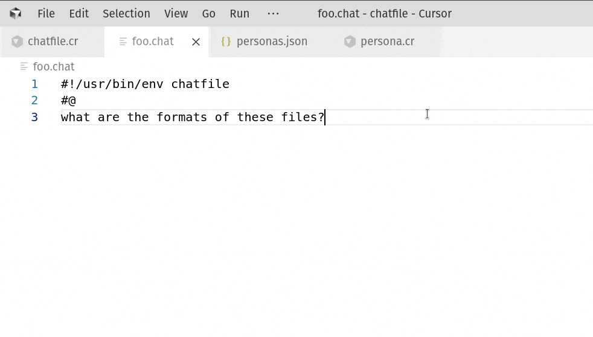

# chatfile

Plain-text AI



## Why?

AI input is text. AI output is text. Text belongs in a text file. Text files belong in a text editor.

It just makes sense.

## What?

1) A file format for a text interaction between a human and an LLM. Like a screenplay or dialog
2) A program that interprets this file and fills in a response from an LLM

Example chatfile:
```
#!/usr/bin/env chatfile
#@ user
Kindly relate a humorous anecdote regarding a jungle fowl and a transit corridor
#@ brainstorm
<thinking>Any number of cliched jokes about a chicken crossing the road would fit. But the user's word choice is oddly technical. Let's try something more futuristic.</thinking>
#@ ai
What motivation compelled the RoosterBot to trespass across the hyperlane? To access the excluded zone!
```

## Details

- Use models on OpenRouter, AWS Bedrock, OpenAI, or Anthropic
- Configure prompts, providers, models, parameters in `~/.config/chatfile/personas.ini` 
```ini
[global]
prompt = You are a terse and efficient assistant
provider = bedrock
model = us.anthropic.claude-3-7-sonnet-20250219-v1:0
temperature = 0.7

[shakespeare]
prompt = You are William Shakespeare, the Bard of Avon,
  loquacious poet, author not only of classic plays in
  English, but of the English language itself
temperature = 0.7
provider = openrouter
model = meta-llama/llama-3.3-8b-instruct:free
```
- Separate blocks with "persona lines", starting with `#@`
- Reference shortcuts in a persona line `#@ shakespeare` to merge the parameters from the config file
- Give context from commands with "shell blocks", labeled `#@ $`
  - Commands in the block will be executed and the output provided to the model
  - Add a path (`#@ $ ~/projects/`) to change the working directory for the shell commands
- Force structured output by putting a json schema in a block tagged `#@ {}`
  - (Hint: ask the LLM to write one, then change the block tag)
